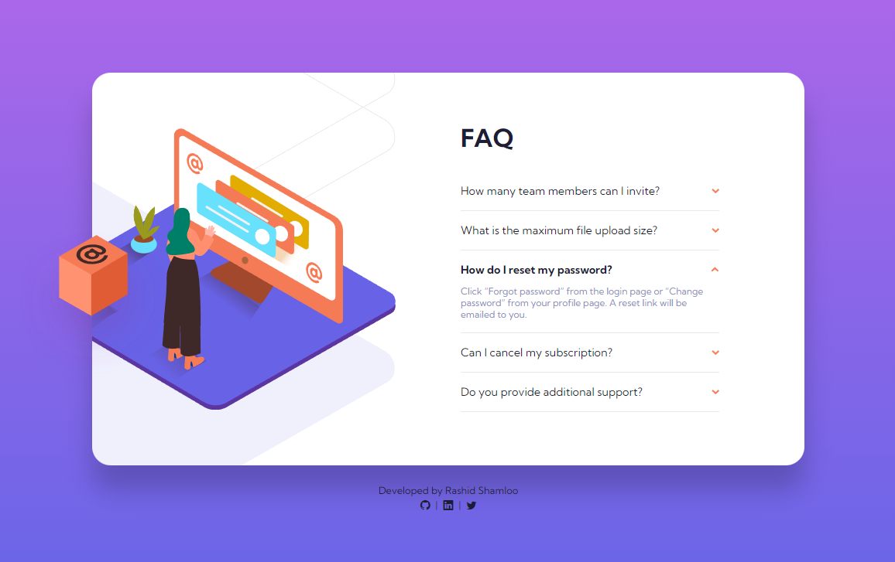
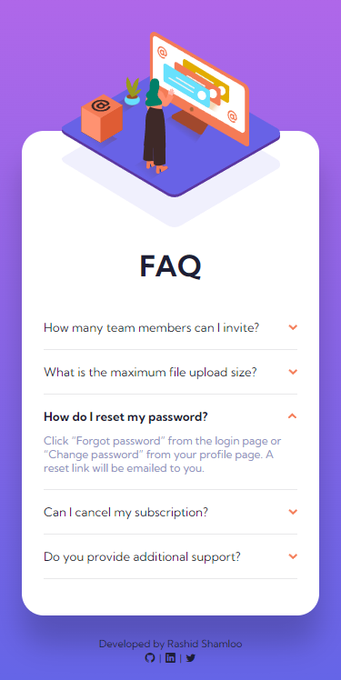

# Front End Mentor - Project 013 - FAQ Accordion Card

This is a solution to the [FAQ Accordion Card challenge on Frontend Mentor](https://www.frontendmentor.io/challenges/faq-accordion-card-XlyjD0Oam).

## Table of contents

- [Overview](#overview)
  - [Screenshot](#screenshot)
  - [Links](#links)
- [My process](#my-process)
  - [Built with](#built-with)
  - [What I learned](#what-i-learned)
- [Author](#author)

## Overview

### Screenshot

- Desktop

- Mobile

### Links

- Solution URL: https://github.com/rashidshamloo/fem_013_faq-accordion-card/
- Live Site URL: https://rashidshamloo.github.io/fem_013_faq-accordion-card/

## My process

### Built with

- Semantic HTML5 markup
- Sass
- CSS Flexbox
- Vanilla Javascript

### What I learned

- Showing / Hiding and Animating different elements using CSS and Javascript
- Positioning multiple SVG images on top of each other and changing them depending on the device
- Using "visibility:hidden;" instead of "opacity:0;" to prevent the element from receiving clicks

## Author

- Frontend Mentor - [@rashidshamloo](https://www.frontendmentor.io/profile/rashidshamloo)
- Twitter - [@rashidshamloo](https://www.twitter.com/rashidshamloo)
